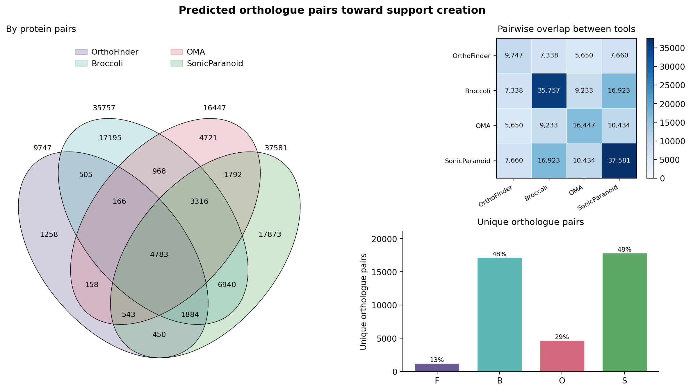

# SuppOrth

SuppOrth (Support-based Orthologue integration) is a lightweight, flexible Python tool to unify and compare orthologue predictions across multiple tools.

It aggregates orthologue calls from various predictors, enriches them with BLAST alignment data, and optionally collapses isoform-level matches to gene-level orthology relationships.

-----------------------
Features:
-----------------------
- Combine results from multiple orthologue predictors (e.g., Broccoli, SonicParanoid, OrthoFinder,OMA etc.)
- Support-aware integration of orthologue calls
- Use BLAST identity and e-value for additional scoring
- Optional collapsing of isoforms using protein-to-gene mapping
- JSON and Pickle support for input formats

-----------------------
Recomended Orhtology tools
-----------------------
The script is not constrained to any specific tool, but it is recomended to combine variety of aligner, clustering stratgies to improve the consensus support.

Here we use:
- [Orthofinder](https://github.com/davidemms/OrthoFinder?tab=readme-ov-file)
- [OMA](https://omabrowser.org/standalone/)
- [SoniParanoid2](https://gitlab.com/salvo981/sonicparanoid2)
- [Broccoli](https://github.com/rderelle/Broccoli)

-----------------------
Install
-----------------------

    pip install .
    suppOrth install

`suppOrth install` does two things. It builds a **shared binary layer** in
`~/.supporth/bin`, holding one copy of each helper program the predictors need
(DIAMOND, MMseqs2, BLAST+, MAFFT, IQ-TREE, FastTree, FastME, MCL), and it clones
each predictor from its own upstream repository at a **pinned ref**, recording
the resolved commit.

Binaries already on your `PATH` are adopted by symlink rather than downloaded,
so the versions you already trust are the ones that get used:

    suppOrth install --adopt diamond=/opt/diamond/diamond
    suppOrth install --ref orthofinder=v2.5.5 --tools orthofinder

Installing from upstream rather than from packaged builds is deliberate:
packaged builds of these tools are often broken or stale, and fetching at
install time keeps differently-licensed sources (OrthoFinder is GPL-3.0) out of
this repository.

Check what you have:

    suppOrth check
    suppOrth audit

-----------------------
Usage
-----------------------

Give it two proteomes and it does the rest:

    suppOrth run speciesA.faa speciesB.faa -o results/ -t 16

The predictors run **in series** — each one saturates the machine on its own —
and every finished stage is written to disk, so an interrupted run resumes
without repeating work:

    suppOrth run speciesA.faa speciesB.faa -o results/ --resume

Useful options:

    --tools orthofinder,broccoli   run a subset
    --min-support 2                keep only pairs two or more predictors agree on
    --annotate diamond|blast|none  aligner used for the identity/e-value columns
    --collapse map1.json,map2.json collapse isoforms to genes
    --opt orthofinder="-M msa"     pass extra arguments to one predictor

-----------------------
Choosing methods per predictor
-----------------------

Only OrthoFinder exposes a choice of tree builder. Broccoli builds its trees
with FastTree, and SonicParanoid builds none at all, so the tree method is an
OrthoFinder setting rather than a global one.

OrthoFinder defaults here to BLAST, MAFFT and IQ-TREE (`-S blast -M msa -A mafft
-T iqtree`). That is slower than dendroblast or FastTree, and it is the point:
the consensus then combines a maximum-likelihood gene-tree method, Broccoli's
FastTree-based phylogenetic clustering, SonicParanoid's MMseqs2/Pfam graph, and
OMA's distance consistency, rather than four variations of the same idea.

Override only when you want a faster or less phylogenetic OrthoFinder:

    suppOrth run A.faa B.faa -o results/ --opt orthofinder="-M dendroblast"
    suppOrth run A.faa B.faa -o results/ --opt orthofinder="-T fasttree"

The aligner and tree builder are read back out of the options, so preflight
demands the right binaries before the run starts and `provenance.json` records
what was actually used.

-----------------------
Parallelism
-----------------------

OrthoFinder parallelises its all-versus-all search by running many
*single-threaded* processes at once. Every stock search command is pinned to one
core (`diamond ... -p 1`, `mmseqs ... --threads 1`), and the built-in `blast`
method is assembled in Python with no thread flag at all.

That works when there are many species, because the job count is the square of
the number of proteomes. SuppOrth compares exactly two, which gives **four**
search jobs. Four single-threaded processes are all you get no matter how large
`-t` is, so most of a big machine idles through the longest stage of the run.

SuppOrth fixes this through OrthoFinder's own extension mechanism: it registers
`supporth_*` search methods in the pinned install's `config.json`, identical to
the stock ones except that they take a real thread count, and divides the cores
between the four jobs. On 32 cores that is four searches of eight threads each
instead of four searches of one.

The stock entries are left untouched, the original file is kept as
`config.json.supporth-orig`, and the resolved thread split is written to
`provenance.json`.

Where OrthoFinder's configuration lives, since it moves around between versions:
`config.json` sits **next to the code** in `scripts_of/`, not in your home
directory. OrthoFinder additionally merges `~/config_orthofinder_user.json` if
that file exists — that is the home-directory config you may remember, and it
can define search, MSA and tree methods. SuppOrth deliberately does not write it:
it is global to your account, while the thread count belongs to a single run.

-----------------------
No duplicated binaries
-----------------------

Predictors ship their own copies of the same helper programs. OrthoFinder
carries `diamond`, `mcl` and `fastme` in `scripts_of/bin/` and — importantly —
**prepends that directory to `PATH`**, so its bundled copies win over the shared
ones unless something is done about it.

    suppOrth audit           # list helper binaries found inside the predictors
    suppOrth audit --link    # point them at the shared copy (reversible)
    suppOrth audit --restore # put each predictor's own copy back

Each entry is reported as `duplicate` (same build as the shared one),
`divergent` (a different build, so two predictors are not searching with the
same program), `unrunnable` (built for another platform) or `linked`.

`unrunnable` is common and easy to miss: source distributions carry binaries for
whatever platform the author built on. A source install of OrthoFinder on macOS
ships **Linux x86-64** executables that cannot run at all.

Predictors that prepend their own directory to `PATH` are collapsed onto the
shared binaries automatically at install time, since for those the shared layer
would otherwise be ignored. Use `--keep-bundled` to opt out. Predictors that
merely bundle a copy are reported but not touched, because some of them track a
specific build closely.

-----------------------
Why run the predictors from one place
-----------------------

The three tools depend on an overlapping set of helper binaries. Installed
separately that means several copies at several versions, which is the usual
source of "it worked last month". SuppOrth keeps one copy of each and puts that
directory first on `PATH` for every predictor.

Sharing the *installation* is not the same as sharing the *choice*: each
predictor still runs with its own search program, tree builder and clustering
method, and that spread is what makes agreement between them informative.
Both the shared binary versions and the per-predictor method choices are written
to `provenance.json` next to every result.

-----------------------
Output:
-----------------------
A run directory contains:

| File | Contents |
|------|----------|
| `suppOrth.tsv` | one row per protein pair: `Lv_support`, `SupportedBy`, identity, e-value, bitscore |
| `suppOrth.png` / `suppOrth.svg` | protein-pair Venn, pairwise overlap heatmap, and exclusive-pair bars |
| `agreement_summary.tsv` | how many pairs each exact combination of predictors accounts for |
| `pairs/<tool>.json` | each predictor's calls in canonical form, reusable with `--resume` |
| `provenance.json` | predictor commits, method profiles, binary versions, input checksums |
| `suppOrth.genes.tsv` | gene-level table, when `--collapse` is used |
| `work/` | each predictor's native output and stage logs |

Example (`head` of `suppOrth.tsv`):

```
contortus      tmuris            Lv_support  SupportedBy                              orthofinder  sonicparanoid  broccoli  oma  Identity  e_val  Bitscore
XGW29141.1     TMUE_3000011065   4           orthofinder,sonicparanoid,broccoli,oma   1            1              1         1    49.528    0.0    6611.0
XGW23970.1     TMUE_3000013576   4           orthofinder,sonicparanoid,broccoli,oma   1            1              1         1    58.248    0.0    5622.0
XGW20628.1     TMUE_1000003594   4           orthofinder,sonicparanoid,broccoli,oma   1            1              1         1    48.045    0.0    4532.0
XGW20629.1     TMUE_1000003594   4           orthofinder,sonicparanoid,broccoli,oma   1            1              1         1    48.045    0.0    4532.0
XGW20630.1     TMUE_1000003594   4           orthofinder,sonicparanoid,broccoli,oma   1            1              1         1    48.045    0.0    4532.0
XGW20631.1     TMUE_1000003594   4           orthofinder,sonicparanoid,broccoli,oma   1            1              1         1    48.045    0.0    4532.0
XGW20632.1     TMUE_1000003594   4           orthofinder,sonicparanoid,broccoli,oma   1            1              1         1    48.045    0.0    4532.0
XGW20634.1     TMUE_1000003594   4           orthofinder,sonicparanoid,broccoli,oma   1            1              1         1    48.045    0.0    4532.0
XGW20635.1     TMUE_1000003594   4           orthofinder,sonicparanoid,broccoli,oma   1            1              1         1    48.045    0.0    4532.0
XGW16501.1     TMUE_2000006962   4           orthofinder,sonicparanoid,broccoli,oma   1            1              1         1    88.86     0.0    4352.0
```

`SupportedBy` holds the **exact set** of predictors that reported a pair, so a
row states its own agreement pattern (`F+S`, `B` alone, and so on) rather than
just a count.

Pairs with no alignment are reported as `NA`, not as zero identity — those are
different statements, and a zero sorts like a real value.

Interpreting support: it is a **filter**, not a probability. These predictors
share inputs and, in part, algorithmic lineage, so they are not independent
observers. A high count trades recall for precision; it is not a calibrated
confidence.

-----------------------
Output visualization:
-----------------------
Each run writes `suppOrth.png` and `suppOrth.svg` from the **protein-pair**
calls: a 2–4 set Venn, a pairwise overlap heatmap, and a bar chart of pairs
unique to one predictor. Gene-level collapse (`--collapse`) is a table only;
it is not plotted.



  
